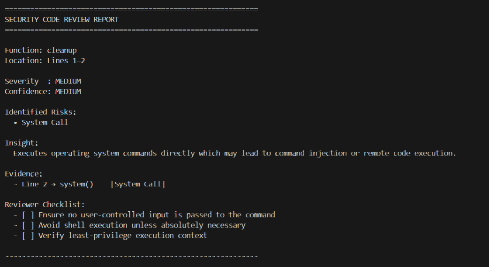

# Security-code-review-assistant
AST-based assistive security tool that that helps developers and security reviewers identify **security-sensitive code paths** during **manual code reviews**.

> This tool does NOT claim to detect vulnerabilities.
> It provides **review guidance**, not verdicts.


## Purpose
Many real-world security issues arise from subtle logic flaws involving:
- User input handling
- System command execution
- File system access
- Authentication logic

This tool highlights **review-worthy areas** and explains:
- **Where** the risk exists
- **Why** it matters
- **What** a reviewer should check

##  How It Works

1. Parses Python source code using the **Abstract Syntax Tree (AST)**
2. Extracts raw signals such as:
   - Function definitions
   - Function calls
3. Applies **rule-based security interpretation**
4. Correlates signals **at function level**
5. Produces **review-grade findings** with:
   - Severity
   - Confidence
   - Evidence
   - Reviewer checklist


##  What This Tool Does NOT Do

-  No vulnerability confirmation
-  No exploit detection
-  No CVE mapping
-  No automatic fixes

This is an **assistive AppSec tool**, designed to support **human-led security reviews**.

##  Project Structure

```
security-code-review-assistant/
│
├── analyzer/
│   └── ast_parser.py        # AST parsing logic
│
├── engine/
│   └── rule_engine.py       # Rule matching and correlation
│
├── rules/
│   └── rules.json           # Security heuristics (JSON)
│
├── reports/
│   └── sample_report.json   # Generated analysis reports
│
├── sample.py                # Demo input file
├── main.py                  # CLI entry point
├── .gitignore
└── requirements.txt

```
## Example output



## Limitations

- No taint or inter-procedural analysis
- Python-only support
- Heuristic-based detection

Findings should be reviewed manually.
